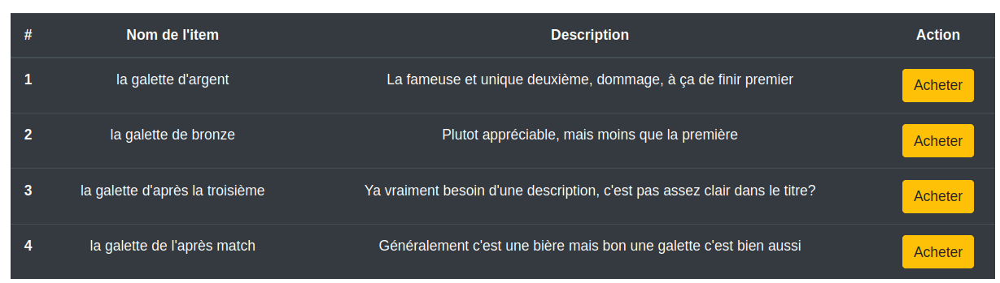
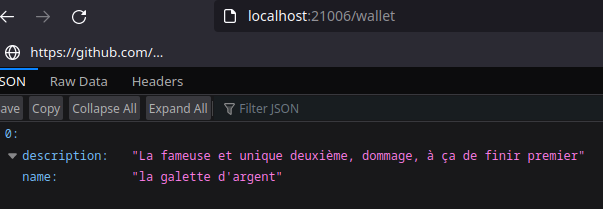
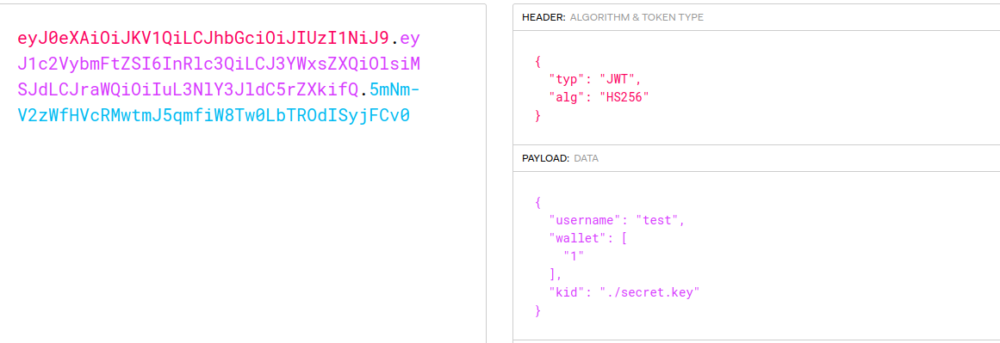
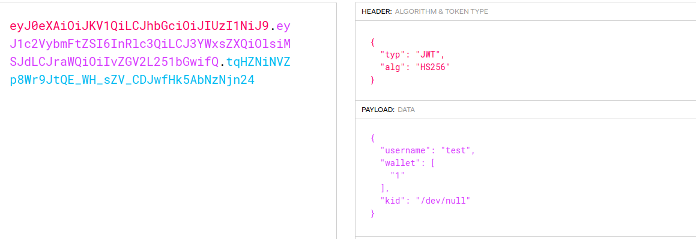
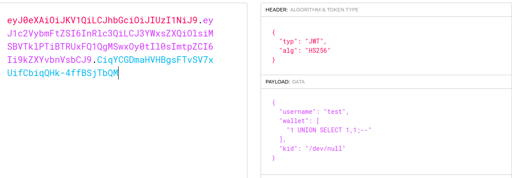
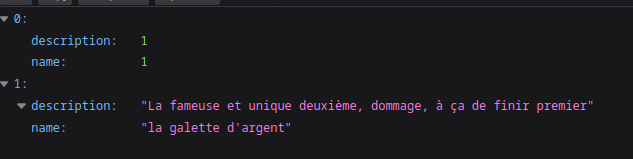
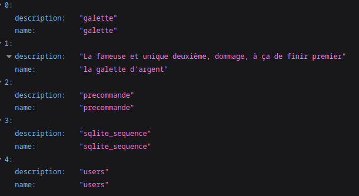
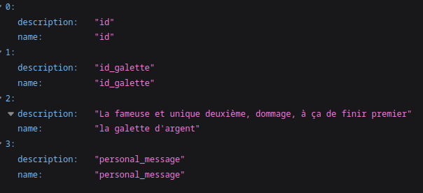
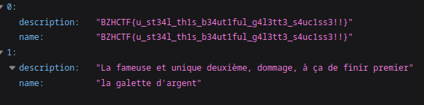

# La galette à tout prix

### Description

Vous connaissez les fameux NFT ? Au stade rennais on fait la même chose, mais avec des galettes ! La galette la plus prisée est la galette d'or de Monsieur Rennes Whisky !

En tant que grand fan, vous la voulez absolument, trouvez un moyen d'obtenir cette galette d'or pour frimer auprès de vos potes !

`https://la-galette-a-tout-prix.ctf.bzh:21000/`

### Solution

On arrive sur une page qui nous propose d'acheter des galettes saucisses NFT. Pour cela, on va donc se créer un compte sur l'application.

Une fois cela fait, on arrive sur une page nous proposant d'acheter des galettes :



Si l'on achète un de ces items, on peut aller prévisualiser notre wallet :



Si l'on essaye de comprendre comment l'application fonctionne, on remarque que notre wallet ainsi que notre compte sont référencés par un Json Web Token (JWT):



Ici, on remarque rapidement le paramètre "kid", qui référence le fichier qui va permettre de signer le JWT.

Par ailleurs, dans le javascript côté client, on remarque un endpoint API qui va nous être utile :

```
setTimeout(function(){
    $.ajax({
        type: "GET",
        url: "/api/renew",
        dataType: "json"
    })
},36000)
```

Ici, on va réaliser un premier exploit qui va nous permettre de controler les valeurs du JWT. En effet, on peut modifier le "kid" pour le faire pointer vers "/dev/null" (autrement dit, rien) et de faire resigner ce token avec le contenu de "/dev/null", ce qui nous permettra ensuite d'injecter ce que l'on veut dedans :



On controle maintenant ce qui est passé dans le JWT !

On remarque que dans le wallet (du jwt), des ids sont passés. Ici, on peut passer l'id "0" qui référence la galette d'or, mais cela ne servira pas à grand chose car nous n'allons pas obtenir la phrase secrète qui prouve qu'elle est à nous.

Après réflexion, on peut penser à une injection SQL dans les ids du wallet. Pour cela, on va tester une simple injection pour énumérer le nombre de colonnes sélectionnées par l'application en backend :





Cela nous apprend deux choses :
- Il y a effectivement une injection SQL
- Le backend sélectionne deux colonnes

On a donc notre exploit chain :
- Aller chercher le nom des tables
- Aller chercher le nom des colonnes d'une table en particulière
- Récupérer notre fameuse phrase secrète

Après un peu d'énumération (et d'erreur 500), on arrive à récupérer la technologie utilisée pour la base de données, c'est du sqlite.

On va donc injecter cette payload pour récupérer le nom de toutes les tables :
```
{
  "username": "test",
  "wallet": [
    "1 UNION SELECT name,name FROM sqlite_master;--"
  ],
  "kid": "/dev/null"
}
```



La table qui nous intéresse est la table "précommande", il va donc falloir aller énumérer ses colonnes pour ensuite extraire ce que l'on souhaite. Pour cela, nous allons utiliser la payload suivante :

```
{
  "username": "test",
  "wallet": [
    "1 UNION SELECT name,name FROM PRAGMA_TABLE_INFO('precommande');--"
  ],
  "kid": "/dev/null"
}
```



Dernière étape, aller chercher la valeur de "personal_message", on utilise la payload suivante :

```
{
  "username": "test",
  "wallet": [
    "1 UNION SELECT personal_message,personal_message FROM precommande;--"
  ],
  "kid": "/dev/null"
}
```



### Flag

BZHCTF{u_st34l_th1s_b34ut1ful_g4l3tt3_s4uc1ss3!!}